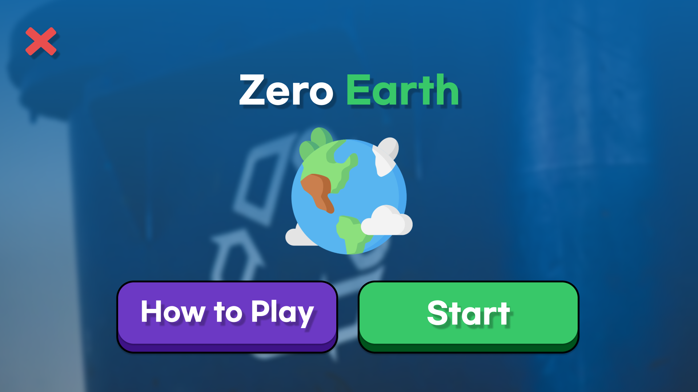
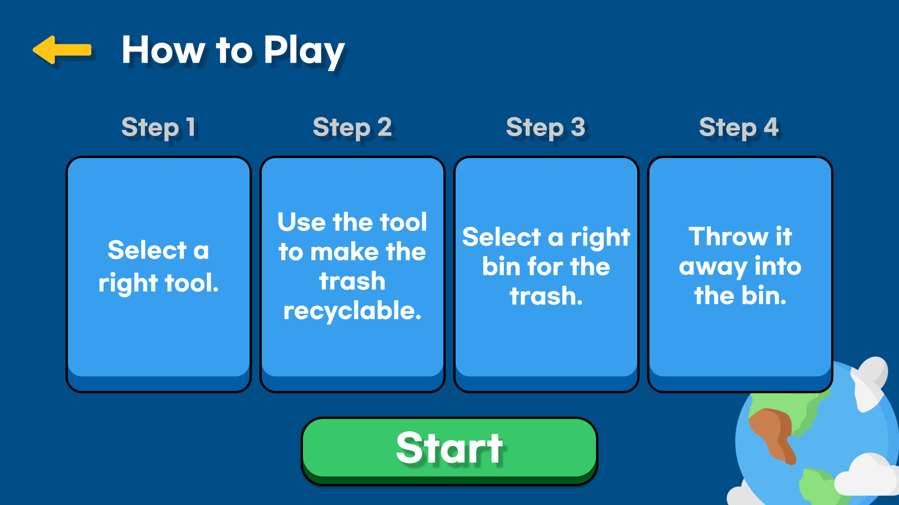
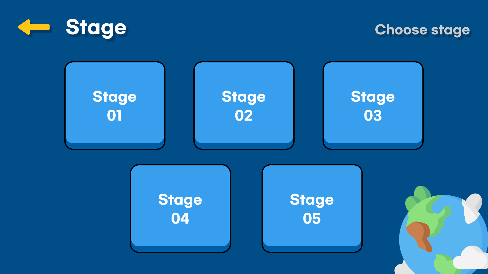
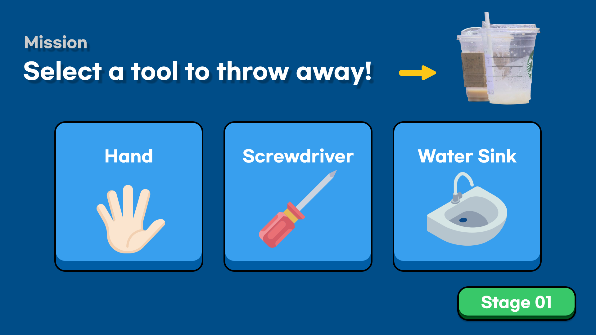
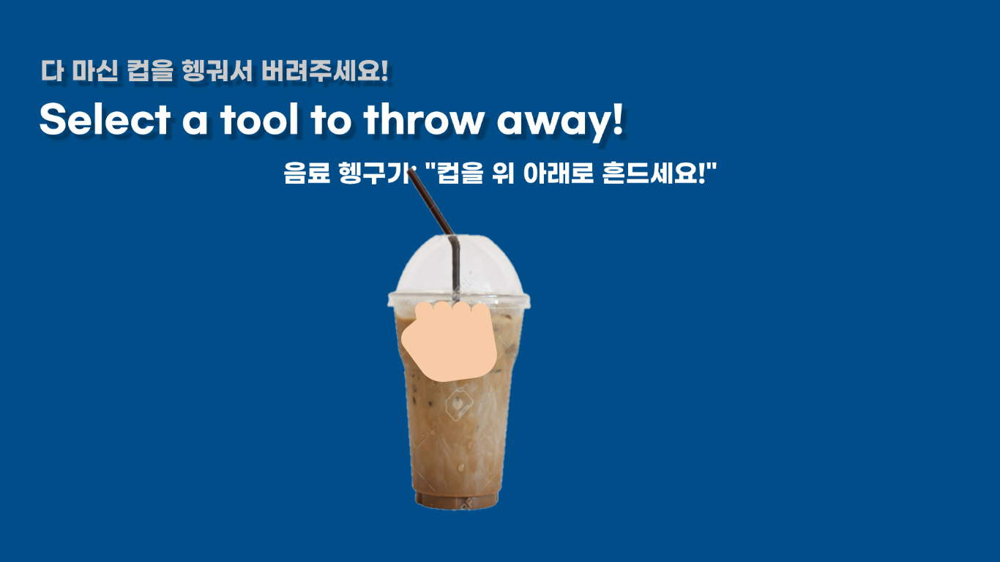
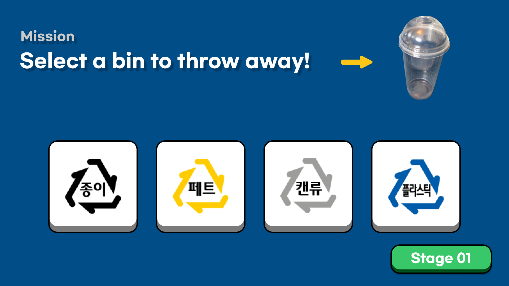
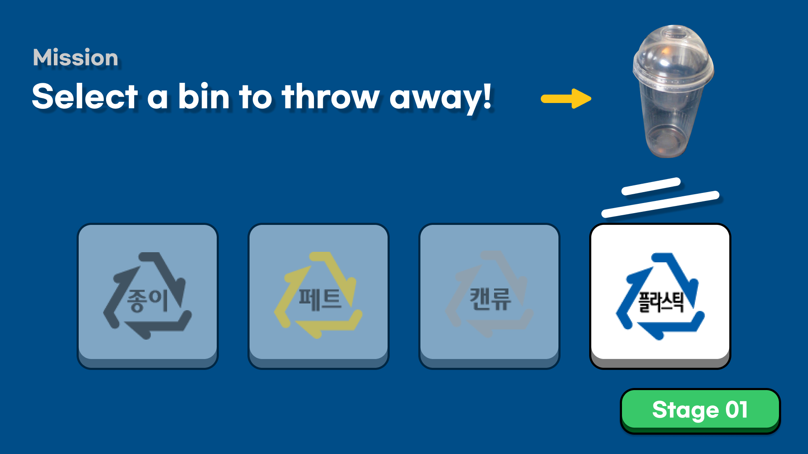
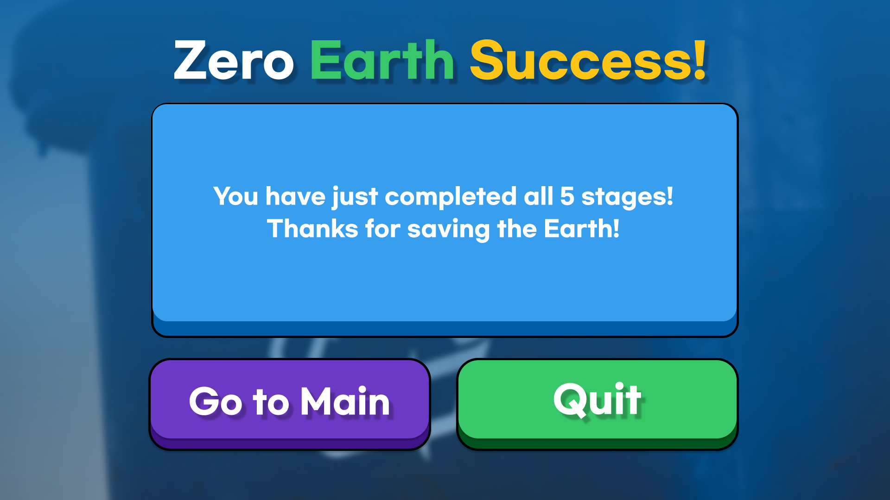

# 분리수거 교육 프로그램
## 1. Introduction
### 1.1 Background
### 1.2 Target
### 1.3 Goal


## 2. Main Contents
### 2.1 Scenario
### 2.2 Prototype
#### 2.2.1 첫 화면
첫 화면에서 How to Play 버튼을 통해 전체 게임의 흐름을 알 수 있고, Start 버튼을 통해 Stage 선택 화면으로 이동한다. 


#### 2.2.2 How to Play
게임의 전체적인 진행 순서를 설명한다. 
Start 버튼을 통해 Stage 선택 화면으로 이동한다. 
.

#### 2.2.3 Stage 선택
사용자가 각 스테이지를 선택하여 플레이 할 수 있다. 


#### 2.2.4 Stage 1 ~ 5 : 도구 선택 
각 스테이지의 쓰레기를 분리수거 하기 위한 도구를 선택한다.


#### 2.2.5 Stage 1 ~ 5 : 분리수거를 위한 전처리
각 스테이지의 쓰레기를 분리수거 하기 위한 행동을 한다. 


#### 2.2.6 Stage 1 ~ 5 : 쓰레기통 선택
각 스테이지의 쓰레기를 버리기 위한 쓰레기통을 선택한다. 



#### 2.2.7 잘못된 선택지를 고른 경우
잘못된 선택지를 고른 경우 에러 화면이 뜨고, Back to Game 버튼을 누르면 이전 화면으로 되돌아간다. 


#### 2.2.8 게임 종료
모든 스테이지를 완료했으면, 스테이지를 완료했다는 안내 화면을 띄운다.
Go to Main 버튼을 통해 첫 화면으로 돌아가거나, Quit 버튼을 통해 게임을 종료한다.



### 2.3 User Test
### 2.4 Source Code
#### 2.4.1 기본 움직임
- 주 움직임: 손가락 굽혔다 폄. 'bool finger.IsExtended' method 사용
- `bool finger[n].IsExtended` : Whether or not this Finger is in an extended posture. True, if the pointable is extended.
- 굽힘 -> 요소 선택, 잡고 요소 이동

Leap motion을 통해 인식되는 손(Hand)과 손가락(Finger) Import.
```c#
controller = new Controller();
Frame frame = controller.Frame();
List<Hand> hands = frame.Hands;
List<Finger> fingers = hands[0].Fingers;
```

leapmotion 연결 -> `controller.IsConnected`가 ture일 경우 
손 움직임에 따라 Hand Object 위치 이동

```c#
if (controller.IsConnected){
	this.transform.position = new Vector3(hands[0].PalmPosition[0] / 30, -hands[0].PalmPosition[2] / 30, 0);
        }
else this.transform.position = new Vector3(0, 0, 0);
```

'fingers[n]' : n번째 손가락 인식

손가락 접히는 것 인식하면 "Sprites/hand" 폴더의 0번째 이미지로 변경 (주먹) , 
그 외 "Sprites/hand"폴더의 1번째 이미지로 변경 (손 펼침)
```c#
if (fingers[1].IsExtended == false &
    fingers[2].IsExtended == false &
    fingers[3].IsExtended == false){
    	SpriteRenderer spriteR = gameObject.GetComponent<SpriteRenderer>(); // gameObject의 SpriteRenderer
	Sprite[] sprites = Resources.LoadAll<Sprite>("Sprites/hand");
	spriteR.sprite = sprites[0];
        }
else {
	SpriteRenderer spriteR = gameObject.GetComponent<SpriteRenderer>();
	Sprite[] sprites = Resources.LoadAll<Sprite>("Sprites/hand");
	spriteR.sprite = sprites[1];
}
```

gameObject(=this)(사용자 손)의 위치가 'target1' object의 범위 안에 있으면서 손가락을 굽히면 'How to play' Scene으로 씬 전환 
```c#
if (this.transform.position.y > target1.transform.position.y - 0.5f &
    this.transform.position.y < target1.transform.position.y + 0.5f &
    this.transform.position.x > target1.transform.position.x - 1.0f &
    this.transform.position.x < target1.transform.position.x + 1.0f &
    fingers[1].IsExtended == false){
    	SceneManager.LoadScene("How to play"); // 씬 전환
        }
```
--------
#### 2.4.2 Stage 1 미션 주요 움직임
- 미션에서 사용되는 주요 움직임만 기재하였음.

`hand.ParmVelocity` : The speed and movement direction of the palm in millimeters per second.

`hands[0].PalmVelocity.y' : y축에 대해 손 움직임의 속도를 측정.

-3500 이하일 때 'full' object의 이미지가 "Sprites/stage1" 폴더에 있는 이미지 요소로 변경
```c#
if (hands[0].PalmVelocity.y < -3500){
	SpriteRenderer spriteR = full.GetComponent<SpriteRenderer>();
	Sprite[] sprites = Resources.LoadAll<Sprite>("Sprites/stage1");
	spriteR.sprite = sprites[0];
        Invoke("Scenechange", 3); // 3초 뒤 Scenechange 함수 실행
	}
```
--------
#### 2.4.3 Stage 2 미션 주요 움직임

`hands[0].PalmVelocity.z' : z축에 대해 손 움직임의 속도를 측정.

-2500 이하일 때 'waste' object의 이미지가 "Sprites/stage2" 폴더에 있는 이미지 요소로 변경
```c#
if (hands[0].PalmVelocity.z < -2500){
	SpriteRenderer spriteR = waste.GetComponent<SpriteRenderer>();
	Sprite[] sprites = Resources.LoadAll<Sprite>("Sprites/stage2");
	spriteR.sprite = sprites[0];
        Invoke("Scenechange", 3); // 3초 뒤 Scenechange 함수 실행
	}
```
--------
#### 2.4.4 Stage 3, 4 미션 주요 움직임

'cutter' object가 'rabel' object 위에 위치하면서 손을 펴면 
'rabel'의 이미지가 "Sprites/norabel" 폴더의 이미지로 변경됨.

- flag로 한 번만 생성될 수 있도록 설정하지 않으면 무한 copy됨. 

```c#
if (rabel.transform.position.y > cutter.transform.position.y - 1.0f &
    rabel.transform.position.y < cutter.transform.position.y + 1.0f &
    rabel.transform.position.x > cutter.transform.position.x - 1.0f &
    rabel.transform.position.x < cutter.transform.position.x + 1.0f &
    fingers[1].IsExtended == true){
    	SpriteRenderer spriteR = rabel.GetComponent<SpriteRenderer>();
	Sprite[] sprites = Resources.LoadAll<Sprite>("Sprites/norabel");
	spriteR.sprite = sprites[0];
        
	if (flag == 0){ // object가 한 번만 생성될 수 있도록 함. 
		Invoke("Vinyl", 0.01f); // Vinyl 함수 실행
        }
      	Invoke("Scenechange", 5);
}

void Vinyl(){
	Instantiate(vinyl, new Vector3 (0.8f, -1.6f, 0), Quaternion.identity); // object 생성 함수: Instantiate(object, location, rotation)
        flag = 1;
}
```
--------
#### 2.4.5 Stage 5 미션 주요 움직임

검지 폄 + 중지, 약지 구부리면 손 이미지를 "Sprites/stage5" 폴더의 이미지로 변경

```c#
if (fingers[1].IsExtended == true &
    fingers[2].IsExtended == false &
    fingers[3].IsExtended == false) {
    	SpriteRenderer spriteR = gameObject.GetComponent<SpriteRenderer>();
	Sprite[] sprites = Resources.LoadAll<Sprite>("Sprites/stage5");
	spriteR.sprite = sprites[0];
        }
```
--------


## 3. Discussion
### 3.1 Limitations and future studies
### 3.2 Conclusion
### 3.3. Reference
https://developer-archive.leapmotion.com/documentation/csharp/api/Leap.Finger.html#extension-functions 
